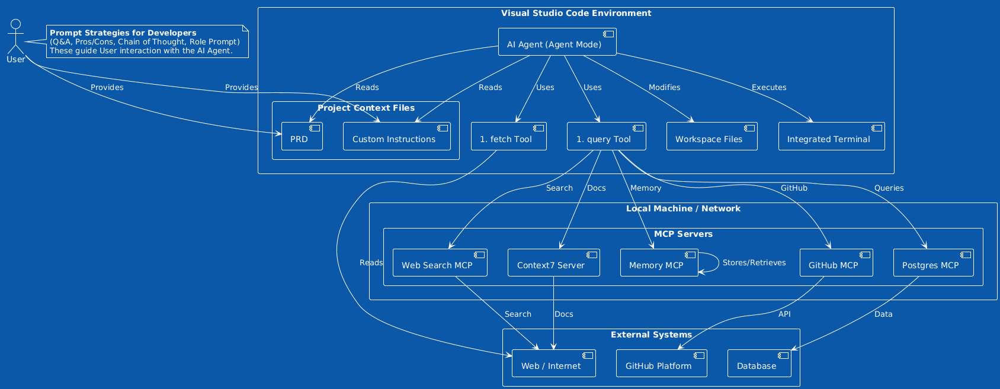

# Agentic AI & Tooling in VS Code

---

## Enhancing Developer Workflows with AI Agent
- Agentic AI capabilities in VS Code
- VS Code's built-in AI tools
- Model Context Protocol (MCP) and MCP servers
- Providing context (PRDs, Instructions, Database Schema)
- Practical examples of VS Code Agent Mode
- Essential Prompt Strategies for developers
- Overview of relevant agent frameworks like CrewAI and LangGraph

---

# Agentic AI in Visual Studio Code

--

## What is Agent Mode?

Agent Mode is a new AI feature in Visual Studio Code. It's available in the chat sidebar alongside "Ask" and "Edit" modes.

--

## Enabling Agent Mode

If you only see "Ask" and "Edit" modes, you may need to **enable Agent Mode** in your user settings by searching for "agent" and checking the corresponding box.

--

## Agent Mode vs. Other Modes

*   **Ask Mode**: Provides an answer to a prompt in the sidebar, standard chat interaction.
*   **Edit Mode**: Gives VS Code permission to **create and modify files** based on the prompt.
*   **Agent Mode**: Makes the agent act more like a developer, running through the necessary steps to complete a task, including installing dependencies or modifying files. It often requires explicit permission from the user for actions like running terminal commands.

---

# VS Code Built-in AI Tools

--

## Accessing Tools

VS Code's AI features provide tools that can be accessed using the pound key (#) in the chat interface.

--

## The `#fetch` Tool

*   Allows the agent to **read content from a web page** given a URL.
*   Useful for providing up-to-date information from online documentation or articles, addressing the issue of LLM training cutoff dates.
*   **Example:** Using `#fetch` on Tailwind CSS documentation to install it correctly in a project. It's important to instruct the model to "follow the instructions exactly" when using fetched content.

--

## The `#query` Tool

*   Provided by **Model Context Protocol (MCP) servers**.
*   Allows the agent to interact with external systems, such as databases, to retrieve information.
*   **Example:** Querying the schema of a database.

---

# Model Context Protocol (MCP)

--

## What is MCP?

MCP stands for **Model Context Protocol**. It is designed to solve the problem of getting VS Code's AI agents to talk to external systems.

--

## How MCP Works

MCP servers are small programs that run on your machine and know how to communicate with different types of systems (like databases). VS Code communicates with these programs via the Model Context Protocol.

--

## MCP Servers

MCP servers can be found and installed locally, often available as Docker containers, NPM packages, or Python packages. You can search for specific MCP servers for the systems you need to interact with.

--

## Examples of MCP Servers

*   **PostgreSQL server:** For interacting with Postgres databases.
*   **Context7:** Makes an AI agent have access to the latest dev docs.
*   **Task Master:** Intended to help create detailed PRD files.
*   **Web search:** For performing web searches.
*   **Knowledge Graph Memory Server:** For storing and retrieving information from memory.
*   **GitHub MCP:** For interacting with GitHub repositories (listing repos, pull requests, issues).

---

# Using MCP and Providing Context

--

## Integrating Context for AI Agents

Providing relevant context is **crucial** for LLMs to be successful, especially given that their training data has cutoff dates. Context helps the agent understand the specific project and requirements.

--

## Adding an MCP Server (Example: Postgres)

1.  Open the Command Palette in VS Code.
2.  Choose "MCP Add Server".
3.  Select the package type (e.g., NPM) and paste the package name.
4.  Allow it to run locally.
5.  Provide the connection string for the external system (e.g., database).
6.  Choose whether to install it in User Settings (available globally) or Workspace Settings (available only to the current project).
7.  Start the server.

--

## Providing Project Context

*   **Project Requirements Document (PRD):** A document outlining the functional requirements of an application. Can be dragged into the agent panel and used to instruct the agent to build the project. The location and name of the PRD file don't matter as long as it's provided to the agent.
*   **Custom Instructions (`copilot-instructions.md`):** A file defining project coding standards, best practices, and technology details. Can be generated with AI and tweaked. Set the `github.copilot.chat.codeGeneration.useInstructionFiles` setting to true to use these.
*   **Database Schema:** Can be provided to the agent via an MCP server like the Postgres MCP.

---

# Practical Example: Building with Agent Mode

--

## Using PRD and Context

By providing the agent with a PRD and necessary context (like database schema via MCP), it can attempt to build an application.

--

## Agent Workflow

In Agent Mode, the AI will perform steps like installing dependencies (requiring user permission) and modifying files. The process can take significant time.

--

## Next Edit Suggestion

VS Code can offer **"Next Edit Suggestions"**, where it anticipates needed changes based on a modification you just made, allowing you to accept the suggestion with a tab or click.

--

## Testing Changes

Agent Mode allows testing changes without immediately committing them. Using the undo feature can roll back all changes made by the agent.

---

# Essential Prompt Strategies for Developers

--

## Strategy #1: Q&A Strategy Prompt

*   **Goal:** Get the AI to ask *you* questions to help *it* provide a better recommendation or response.
*   **Mechanism:** Start with a prompt, then ask the AI to ask you a series of yes/no questions to clarify the requirements.
*   **Benefit:** Helps you remember details you might not have initially included, leading to a better outcome.

--

## Strategy #2: Pros and Cons Prompt

*   **Goal:** Explore multiple ways to implement something and evaluate the trade-offs.
*   **Mechanism:** Ask the AI for different implementation strategies for a task (e.g., database connection logic) and request the pros and cons of each.
*   **Benefit:** Provides several options to choose the best one for your specific needs. You can also mention specific files for the model to review.

---

# Essential Prompt Strategies (Continued)

--

## Strategy #3: Stepwise Chain of Thought

*   **Goal:** Break down complex tasks into smaller, manageable steps and proceed one step at a time.
*   **Mechanism:** Ask the AI to break down a task (like refactoring code) into steps. Use a magic keyword (e.g., "next") to signal when you're ready for the next step.
*   **Benefit:** Prevents the AI from making too many changes at once, making it easier to validate each step. You can also ask clarifying questions about a specific step.

--

## Strategy #4: Role Prompt

*   **Goal:** Give the AI a specific persona or role to play, which can improve its performance in that area.
*   **Mechanism:** Instruct the AI to act as a teacher, expert, etc., and define their characteristics (e.g., "excellent at making complex topics simple"). You can combine this with other strategies like Stepwise Chain of Thought.
*   **Benefit:** Tailors the AI's responses and approach to better suit the desired interaction (e.g., learning a new concept step-by-step with nudges instead of direct answers).

--

## The 3 Ss of VS Code Prompting

*   **Simple**
*   **Specific**
*   **Short**
*   These are general guidelines for writing effective prompts.

---

# Other Relevant AI Agent Frameworks

--

## CrewAI

*   An open-source framework for creating **AI crews**.
*   Allows building **multi-agent systems** where a team of specialized agents work together.
*   **Components:** Agent (autonomous unit with role, goal, backstory), Task (specific assignment), Crew (team defining strategy).
*   Supports sequential and hierarchical task execution.
*   Can analyze sentiment using custom tools.
*   Supports flows for multi-step workflows, with structured or unstructured state management and conditional routing using `@router`.
*   Used in demos for tasks like returns and refunds.

--

## LangGraph

*   A library from the creators of LangChain for building stateful multi-actor applications with LLMs.
*   Models agent workflows as **graphs**.
*   **Components:** State (shared data structure), Nodes (functions handling logic), Edges (determine next node, can be conditional).
*   Enables building both single agent and multi-agent workflows.
*   Supports tool calling for agents to interact with external systems.
*   Can implement multi-agent systems using a supervisor agent to orchestrate specialized agents (e.g., time keeper, schedule keeper).
*   Used in demos for tasks like shop hours inquiry.

---

# Conclusion

--

--

## Agentic Capabilities in VS Code

Agent Mode, built-in tools like `#fetch` and `#query` (via MCP), and the ability to provide extensive project context (PRD, instructions, database schema) are **transforming developer workflows**.

--

## The Power of Context and Prompts

Successfully leveraging these AI tools relies heavily on providing sufficient context and using effective prompt strategies.

--

## Responsible Development

While powerful, AI agents should be introduced cautiously into critical systems with proper guardrails. It's recommended to start small, pick relevant use cases, and **build responsibly**. The field of agentic AI is still evolving with no single industry standard definition.

--

## Resources

*   AI Coding Agents with GitHub Copilot and Cursor (LinkedIn Learning course)
*   Essential AI Prompts for Developers (VS Code YouTube)
*   VS Code Agent Mode Just Changed Everything (VS Code YouTube)
*   CrewAI Examples (GitHub)
*   Shopping Assistant with LangGraph (GitHub Example)
*   TheUrlist PRD (Example Requirements Document)
